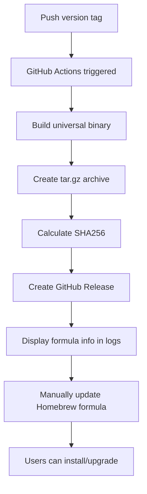

# Homebrew Publishing Guide for xcodeproj-cli

## 📋 Overview

This guide documents the complete procedure for publishing xcodeproj-cli to Homebrew using binary releases. The implementation uses a two-repository system:

1. **Main repository** (`tolo/xcodeproj-cli`) - Contains source code and releases binaries
2. **Homebrew tap** (`tolo/homebrew-xcodeproj`) - Contains the formula that tells Homebrew how to install

## 🔄 The Publishing Flow

### Step 1: Create GitHub Release with Binary

When you push a version tag (e.g., `v1.2.0`), the GitHub Actions workflow automatically handles the build and release:

```bash
# Tag a new version
git tag v1.2.0
git push origin v1.2.0
```

The workflow (`.github/workflows/release.yml`) automatically:
1. Builds universal binary for Intel + Apple Silicon
2. Creates tar.gz archive 
3. Calculates SHA256 checksum
4. Creates GitHub Release with the binary attached
5. Outputs the formula update information in the Actions log

### Step 2: Create Homebrew Tap Repository (One-time Setup)

Create a new GitHub repository for your Homebrew tap:

```bash
# Repository name MUST follow the pattern: homebrew-[name]
# This allows users to tap it as: brew tap tolo/xcodeproj
# 
# Create repository: tolo/homebrew-xcodeproj
```

**Important**: The repository name must start with `homebrew-` for Brew's tap mechanism to work correctly.

### Step 3: Create Initial Formula File

In the tap repository, create the formula file at `Formula/xcodeproj-cli.rb`:

```ruby
class XcodeprojCli < Formula
  desc "Powerful CLI for Xcode project manipulation"
  homepage "https://github.com/tolo/xcodeproj-cli"
  version "1.2.0"
  
  on_macos do
    url "https://github.com/tolo/xcodeproj-cli/releases/download/v1.2.0/xcodeproj-cli-v1.2.0-macos.tar.gz"
    sha256 "abc123..."  # SHA256 from GitHub Actions output
  end
  
  def install
    bin.install "xcodeproj-cli"
  end
  
  test do
    system "#{bin}/xcodeproj-cli", "--version"
  end
end
```

### Step 4: Update Formula for Each Release

After each release, you need to update the formula with:
- New version number
- New download URL  
- New SHA256 checksum (from GitHub Actions output)

## 🎯 Detailed Release Process



## 📝 Manual Steps After Each Release

### 1. Check GitHub Actions Output

After the release workflow completes, check the GitHub Actions log for the formula information:

```
=========================================
📦 Homebrew Formula Information
=========================================

Update your Homebrew formula with:
  version: v1.2.0
  url: https://github.com/tolo/xcodeproj-cli/releases/download/v1.2.0/xcodeproj-cli-v1.2.0-macos.tar.gz
  sha256: abc123def456...

Binary details:
  Size: 3.6M
  Architectures: x86_64 arm64
```

### 2. Update the Formula

Update the formula in your tap repository:

```bash
# Clone your tap repository
git clone https://github.com/tolo/homebrew-xcodeproj
cd homebrew-xcodeproj

# Edit Formula/xcodeproj-cli.rb with the new values
# Update: version, url, sha256

# Commit and push
git add Formula/xcodeproj-cli.rb
git commit -m "Update xcodeproj-cli to v1.2.0"
git push
```

### 3. Test the Installation

Verify the formula works correctly:

```bash
# Add the tap (if not already added)
brew tap tolo/xcodeproj

# Install or upgrade
brew upgrade xcodeproj-cli  # or 'brew install xcodeproj-cli' for first time

# Test it works
xcodeproj-cli --version
```

## 🚀 Future Automation Options

### Option 1: Auto-update Formula via GitHub Actions

Add a step to your release workflow that automatically creates a PR in the tap repository:

```yaml
- name: Update Homebrew Formula
  env:
    GITHUB_TOKEN: ${{ secrets.HOMEBREW_TAP_TOKEN }}
  run: |
    # Clone tap repository
    git clone https://github.com/tolo/homebrew-xcodeproj
    cd homebrew-xcodeproj
    
    # Update formula file with sed
    sed -i '' "s/version \".*\"/version \"${{ env.VERSION }}\"/" Formula/xcodeproj-cli.rb
    sed -i '' "s|url \".*\"|url \"${{ env.DOWNLOAD_URL }}\"|" Formula/xcodeproj-cli.rb
    sed -i '' "s/sha256 \".*\"/sha256 \"${{ env.SHA256 }}\"/" Formula/xcodeproj-cli.rb
    
    # Create PR or direct push
    git config user.name "GitHub Actions"
    git config user.email "actions@github.com"
    git add Formula/xcodeproj-cli.rb
    git commit -m "Update xcodeproj-cli to ${{ env.VERSION }}"
    git push
```

### Option 2: Use Homebrew's Built-in Tools

Use `brew bump-formula-pr` command (requires Homebrew maintainer access):

```bash
brew bump-formula-pr \
  --url=https://github.com/tolo/xcodeproj-cli/releases/download/v1.2.0/xcodeproj-cli-v1.2.0-macos.tar.gz \
  --sha256=abc123... \
  tolo/xcodeproj/xcodeproj-cli
```

### Option 3: GitHub App/Bot

Set up a GitHub App or bot that:
1. Watches for new releases in the main repository
2. Automatically calculates the SHA256
3. Creates a PR in the tap repository with updated formula

## 📦 What Users Experience

### First-time Installation

```bash
# Add your tap (one-time operation)
brew tap tolo/xcodeproj

# Install the tool
brew install xcodeproj-cli

# Tool is now available in PATH
xcodeproj-cli --help
```

### Updating to New Version

```bash
# Update tap information
brew update

# Upgrade to latest version
brew upgrade xcodeproj-cli
```

### Uninstalling

```bash
# Remove the tool
brew uninstall xcodeproj-cli

# Remove the tap (optional)
brew untap tolo/xcodeproj
```

## 🏗️ Required Repository Structure

### Main Repository (tolo/xcodeproj-cli)
```
xcodeproj-cli/
├── .github/
│   └── workflows/
│       └── release.yml        # Automated build and release
├── Sources/
│   └── xcodeproj-cli/
│       └── main.swift         # Swift Package Manager structure
├── Package.swift              # SPM manifest
├── build-universal.sh         # Universal binary build script
└── README.md
```

### Tap Repository (tolo/homebrew-xcodeproj)
```
homebrew-xcodeproj/
├── Formula/
│   └── xcodeproj-cli.rb      # The Homebrew formula
└── README.md                  # Documentation for the tap
```

## ⚠️ Important Notes

### Naming Conventions
- **Tap repository**: MUST be named `homebrew-[something]` for `brew tap` to work
- **Formula class**: Must be CamelCase version of the tool name (e.g., `XcodeprojCli`)
- **Formula file**: Should match the tool name (e.g., `xcodeproj-cli.rb`)

### Technical Requirements
- **SHA256 checksum**: Mandatory for security - Homebrew will reject formulas without it
- **Binary hosting**: GitHub Releases is ideal (reliable, fast CDN, no bandwidth limits)
- **Version tags**: Should follow semantic versioning (v1.0.0, v1.1.0, etc.)
- **Universal binary**: Should support both Intel (x86_64) and Apple Silicon (arm64)

### Best Practices
1. **Test locally first**: Use `brew install --build-from-source Formula/xcodeproj-cli.rb`
2. **Version consistency**: Keep version numbers synchronized across:
   - Git tags
   - Formula version
   - Binary version output
3. **Changelog**: Update CHANGELOG.md with each release
4. **Release notes**: Include comprehensive release notes in GitHub Release

## 🔧 Troubleshooting

### Common Issues and Solutions

**Formula not found**
```bash
# Ensure tap is added correctly
brew tap tolo/xcodeproj
brew tap  # List all taps to verify
```

**SHA256 mismatch error**
```bash
# Recalculate SHA256 of the downloaded file
curl -L [download-url] -o temp.tar.gz
shasum -a 256 temp.tar.gz
# Update formula with correct SHA256
```

**Installation fails on Apple Silicon**
```bash
# Verify universal binary was built correctly
lipo -info xcodeproj-cli
# Should show: "Architectures in the fat file: xcodeproj-cli are: x86_64 arm64"
```

**Old version still installed after upgrade**
```bash
# Force reinstall
brew uninstall xcodeproj-cli
brew install xcodeproj-cli

# Or clean cache
brew cleanup xcodeproj-cli
```

## 📚 Additional Resources

- [Homebrew Formula Cookbook](https://docs.brew.sh/Formula-Cookbook)
- [Creating and Maintaining Taps](https://docs.brew.sh/How-to-Create-and-Maintain-a-Tap)
- [GitHub Releases API](https://docs.github.com/en/rest/releases)
- [Swift Package Manager Documentation](https://swift.org/package-manager/)
- [Building Universal Binaries](https://developer.apple.com/documentation/apple-silicon/building-a-universal-macos-binary)

## 📝 Checklist for New Release

- [ ] Update version number in source code
- [ ] Update CHANGELOG.md
- [ ] Commit all changes
- [ ] Create and push version tag (e.g., `v1.2.0`)
- [ ] Wait for GitHub Actions to complete
- [ ] Verify binary in GitHub Releases
- [ ] Copy SHA256 and URL from Actions output
- [ ] Update Homebrew formula in tap repository
- [ ] Push formula changes
- [ ] Test installation: `brew upgrade xcodeproj-cli`
- [ ] Verify version: `xcodeproj-cli --version`
- [ ] Update documentation if needed

## 🎯 Summary

The Homebrew publishing process for xcodeproj-cli involves:

1. **Automated binary building** via GitHub Actions when tags are pushed
2. **Manual formula updates** in the tap repository after each release
3. **Simple user experience** with standard Homebrew commands

This approach provides users with a fast, dependency-free installation while maintaining the flexibility to use the Swift script version for development purposes.